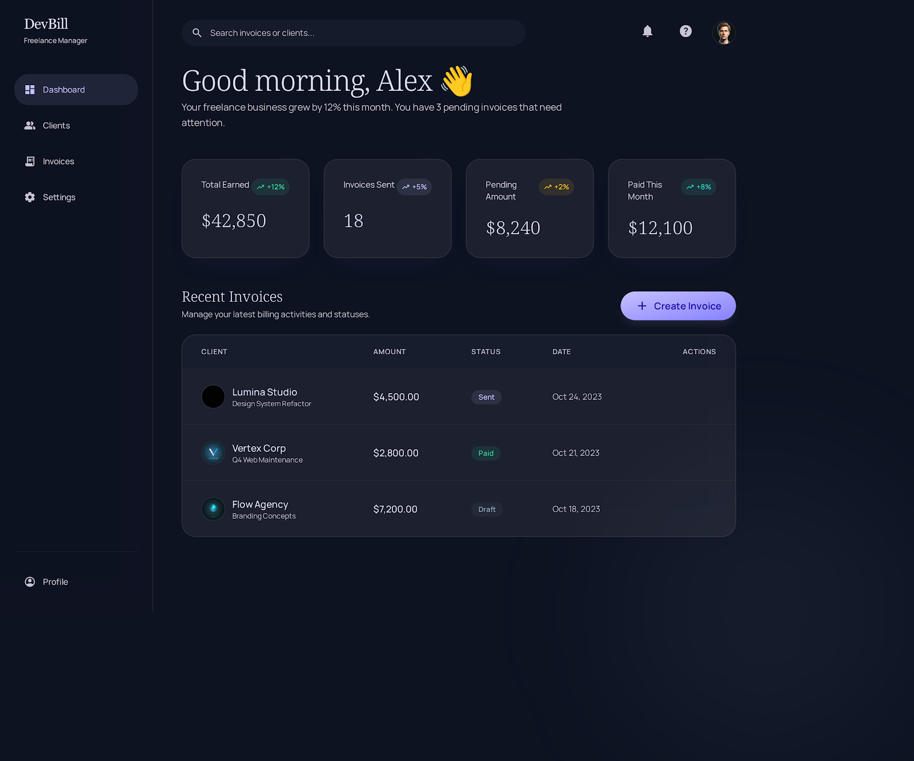
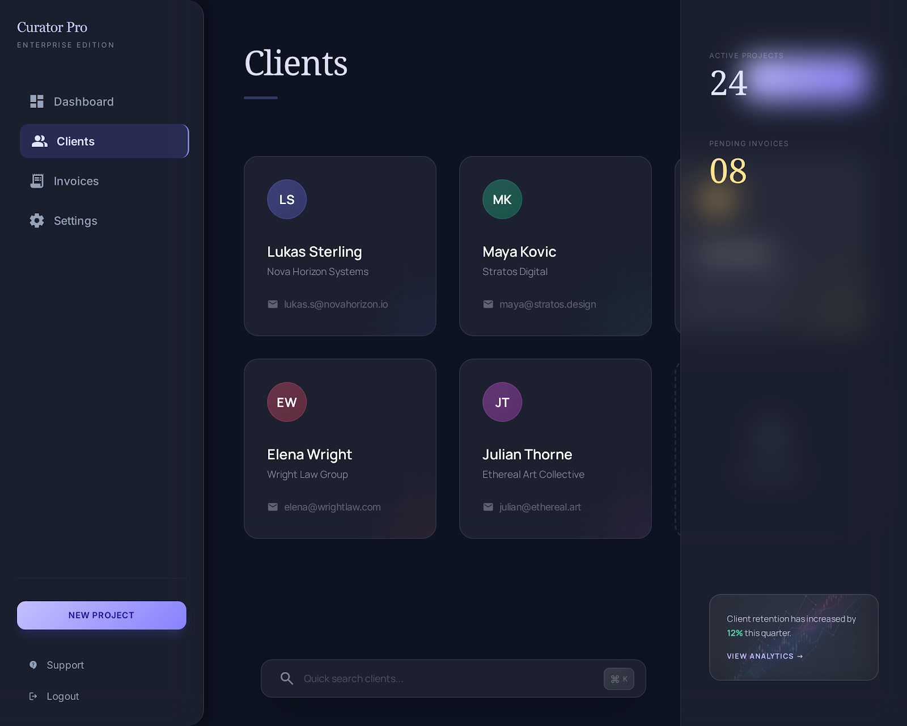
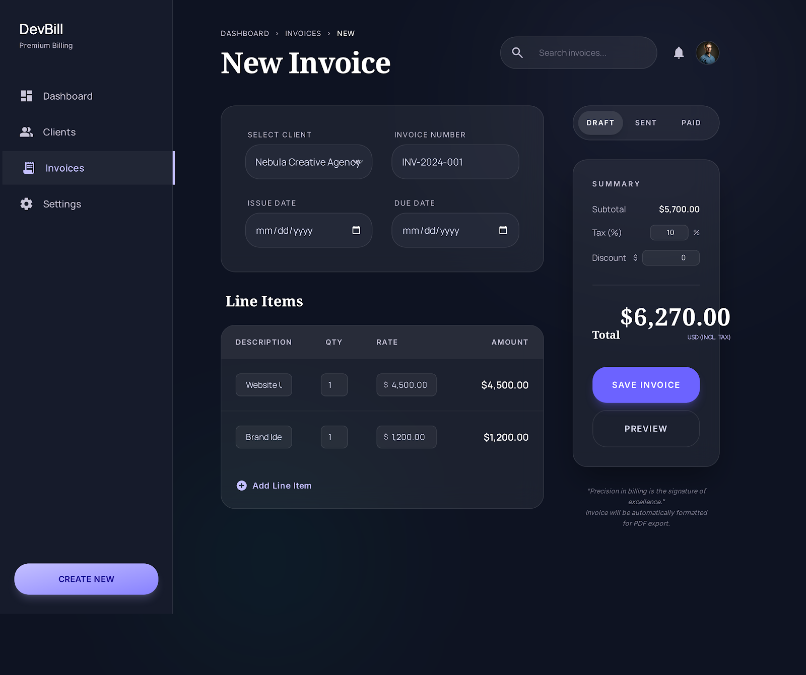
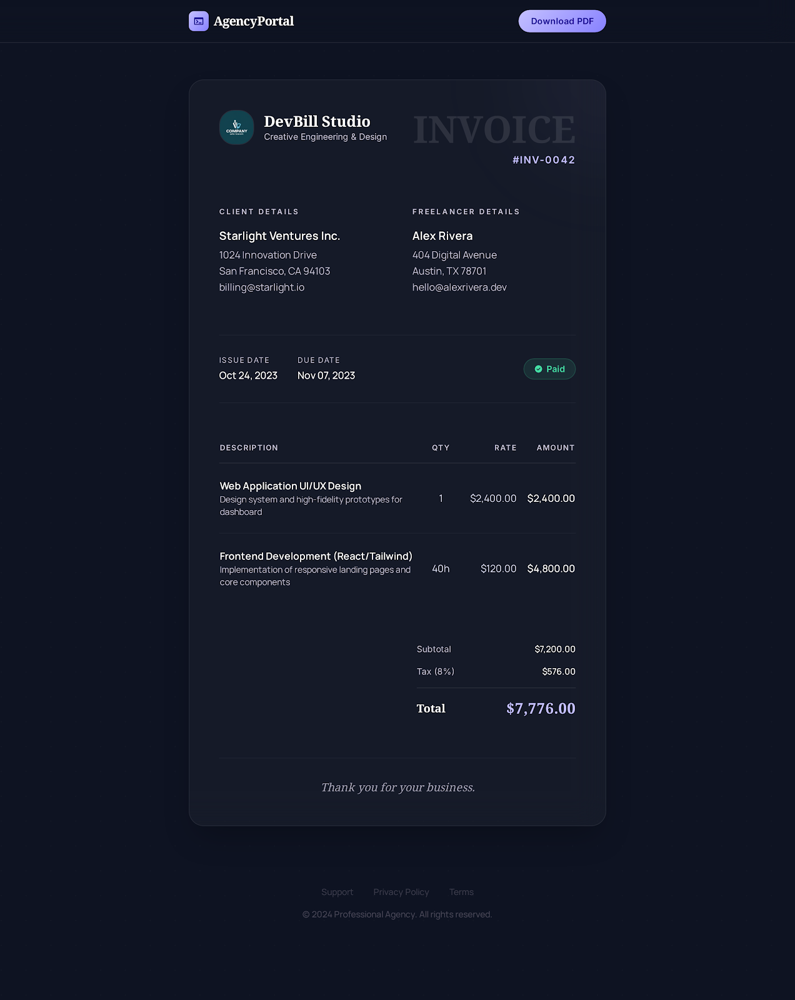

# DevBill

DevBill is a modern invoice and client management dashboard built with Next.js, React, Supabase, and Tailwind CSS.

It is designed as a polished freelancer and agency workflow tool: manage clients, create invoices, track payment status, share public invoice links, and export invoices as PDFs from a clean editorial-style interface.

## Overview

DevBill focuses on two things at the same time:

- making billing operations practical for day-to-day use
- presenting those workflows in a premium, portfolio-worthy UI

The project combines authenticated dashboard workflows with a public invoice view, soft-delete logic, automatic invoice numbering, and PDF export built from the invoice layout itself.

## Screenshots

| Dashboard | Clients |
| --- | --- |
|  |  |

| New Invoice | Public Invoice |
| --- | --- |
|  |  |

## Features

- Secure authentication with Supabase Auth
- Protected dashboard routes with token validation and cookie sync
- Client management with create, edit, search, and soft delete
- Invoice management with create, edit, status updates, filtering, and soft delete
- Automatic invoice numbering with `INV-YYYY-XXXX` formatting
- Dashboard metrics for revenue, pending amounts, invoices, and due payments
- Public invoice share page for client-facing access
- PDF invoice download based on the invoice layout
- Search-driven dashboard experience across invoices and clients
- Responsive glassmorphism-inspired UI system

## Product Flow

### 1. Authentication

Users can sign up and log in with Supabase-backed authentication.

On login, the app:

- creates a session in the browser
- syncs an HTTP-only cookie for protected route access
- restores the authenticated user into React context

### 2. Dashboard

The dashboard gives a quick business snapshot:

- total earned
- invoices sent
- pending amount
- due payments

It also includes a unified search area to quickly surface matching clients and invoices.

### 3. Client Management

Users can:

- add new clients
- browse clients in a card-based grid
- search by name, company, or email
- update existing client records
- soft-delete clients without physically removing them from the database

### 4. Invoice Management

Users can:

- create invoices against existing clients
- define invoice dates, due dates, title, and status
- manage invoice lifecycle states like `pending`, `sent`, `paid`, and `cancelled`
- browse invoice collections with search and status filters
- open detailed invoice pages for edit, share, and download actions

### 5. Public Invoice View

Each invoice can be shared through a public-facing route:

`/invoice/[id]/view`

This lets recipients open a clean invoice page outside the main dashboard experience.

### 6. PDF Export

Invoices can be downloaded as PDFs. The export is generated from the invoice’s visual layout so the downloaded document stays close to the designed invoice presentation.

## Tech Stack

### Frontend

- Next.js 16.2.3
- React 19.2.4
- Tailwind CSS 4
- App Router

### Backend / Data

- Supabase Auth
- Supabase Postgres
- Row Level Security policies

### PDF / Export

- `html2canvas`
- `jspdf`

### Tooling

- ESLint
- React Compiler enabled via Next.js config

## Architecture

### App Structure

The app uses the Next.js App Router with a dashboard-focused route structure:

```text
src/app
├── (auth)
│   ├── login
│   └── signup
├── (dashboard)
│   ├── dashboard
│   ├── clients
│   ├── invoices
│   └── settings
├── invoice/[id]/view
└── api
    ├── auth
    ├── clients
    └── invoices
```

### State Management

The app uses React context instead of a separate state library:

- `AuthContext` manages session, token, and login/signup/logout flows
- `DataContext` manages invoice and client fetching, caching, and mutations
- `ToastContext` and `NotificationContext` support user feedback

### Data Model

The main domain tables are:

- `users`
- `clients`
- `invoices`
- `invoice_counters`

Invoice sequencing is handled through a Postgres RPC function:

- `increment_invoice_number(target_user_id uuid)`

This allows invoice numbers to be assigned atomically per user.

## Database Notes

The Supabase SQL bootstrap file lives at:

`src/schema.sql`

It sets up:

- required tables
- RLS policies
- defaults and indexes
- invoice counter logic
- the RPC for invoice numbering

## API Capabilities

The project exposes route handlers for:

- auth signup
- auth login
- auth logout
- auth cookie sync
- client CRUD
- invoice CRUD
- health checks

The API layer is scoped to authenticated users through token verification and Supabase-backed ownership checks.

## Local Development

### 1. Clone the repository

```bash
git clone <your-repo-url>
cd app
```

### 2. Install dependencies

```bash
npm install
```

### 3. Configure environment variables

Create a `.env.local` file in the project root with:

```bash
NEXT_PUBLIC_SUPABASE_URL=your_supabase_project_url
NEXT_PUBLIC_SUPABASE_ANON_KEY=your_supabase_anon_key
```

### 4. Set up the database

Run the SQL in `src/schema.sql` inside the Supabase SQL editor.

### 5. Start the development server

```bash
npm run dev
```

Open:

`http://localhost:3000`

## Available Scripts

```bash
npm run dev
npm run build
npm run start
npm run lint
```

## Highlights

What makes this project worth featuring on a GitHub profile:

- strong visual direction instead of template-like dashboard UI
- full-stack workflow with auth, data, API routes, and secure access control
- practical product thinking around invoices, clients, public sharing, and export
- real-world database design with RLS and invoice sequencing
- polished interaction flow across dashboard, detail, and public views

## Future Improvements

Potential next steps for the product:

- payment gateway integration for the public invoice page
- richer invoice item persistence in the database
- recurring invoices
- analytics tied to real payment events
- team or workspace support
- email delivery for invoice sharing and reminders

## Author

Built by Jitesh N.

If you are featuring this on your GitHub profile, this README is intentionally written to present DevBill as both:

- a serious full-stack product build
- a UI-focused portfolio project with real functionality
